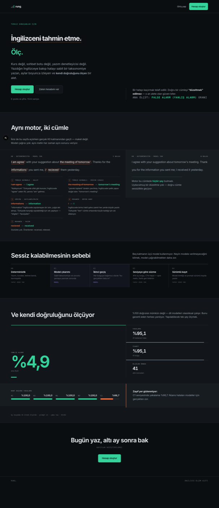
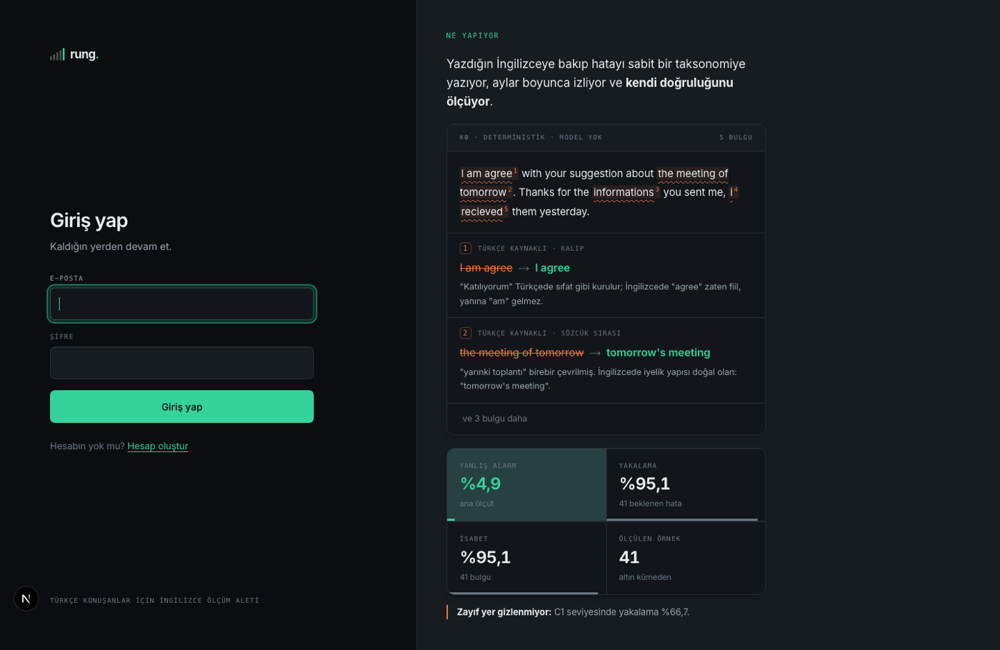
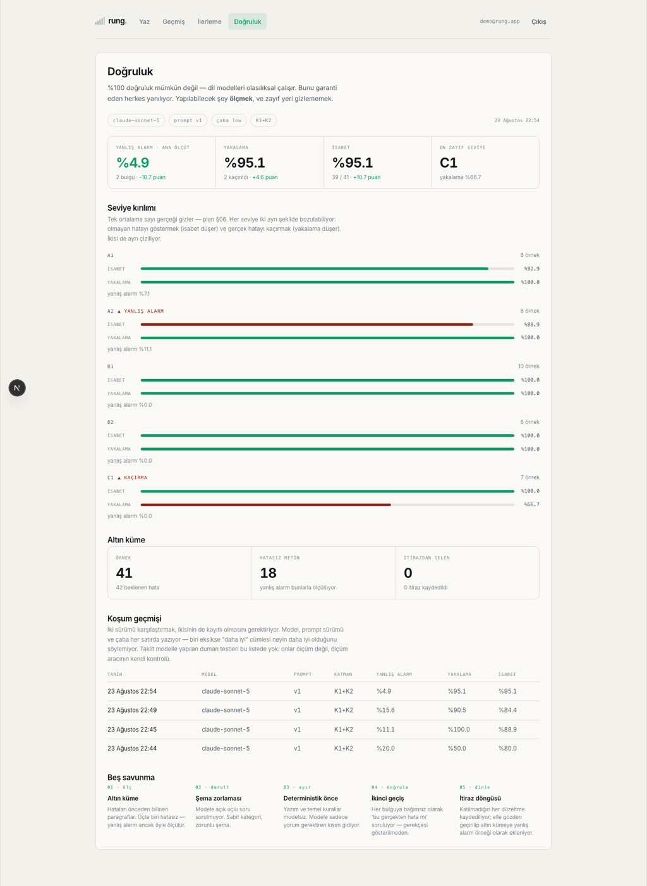
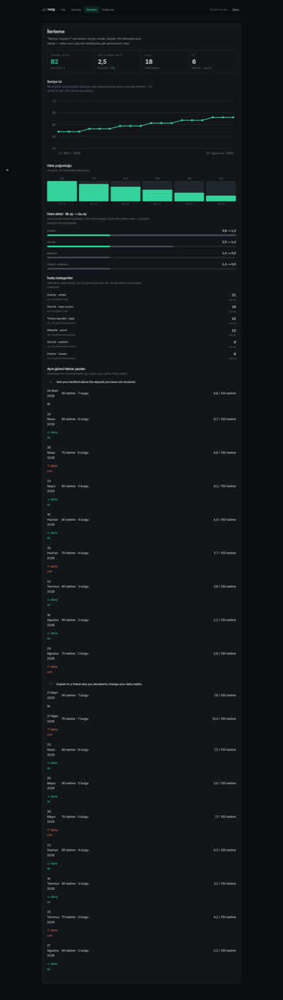
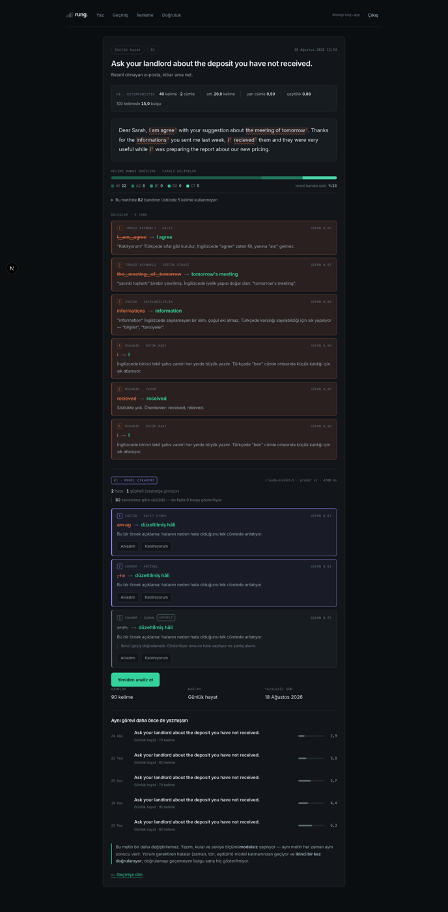

# Rung

Türkçe konuşanlar için bir **İngilizce ölçüm aleti**. Kurs değil, sohbet botu
değil, yazım denetleyicisi değil.

Yazdığın İngilizceye bakar, hatayı sabit bir taksonomiye yazar, aylar boyunca
izler — ve **kendi doğruluğunu ölçer.**

**Canlı → https://rung-plum.vercel.app**

Next.js 16 · TypeScript (katı) · PostgreSQL · Anthropic API · 163 birim testi ·
61 uçtan uca kontrol



<sub>Sayfadaki hiçbir şey maket değil. İki cümle de sayfa açılırken gerçek K0
motorundan geçiyor, doğruluk sayıları son ölçüm koşumundan okunuyor.</sub>

---

## Sayfanın kendisi bir kanıt

Anasayfada iki cümle var ve ikisi de **aynı motordan** geçiyor:

| | bulgu |
|---|---|
| `I am agree with your suggestion about the meeting of tomorrow…` | **5** |
| `I agree with your suggestion about tomorrow's meeting…` | **0** |

İkincisi doğru İngilizce ve motor onda **hiçbir şey bulmuyor**. Ürünün
kanıtlanamaz iddiası — *bir hatayı kaçırmak telafi edilir, doğru bir cümleyi
"düzeltmek" edilmez* — böylece bir cümle olmaktan çıkıp sayfanın render anında
hesapladığı bir olaya dönüşüyor.

`app/lib/k0/showcase.test.ts` iki sayıyı da kilitliyor: bir kural değişip motor
doğru cümleye takılırsa vitrin sessizce yalan söylemiyor, `npm test` düşüyor.

## Çözmeye çalıştığı problem

%100 doğruluk mümkün değil; dil modelleri olasılıksal çalışır. Bunu garanti
eden herkes yanılıyor, ve bunu kabul etmeden tasarlanan sistem yanlış
tasarlanır.

Asıl mesele hangi hatayı **kaçırdığın** değil:

> Bir hatayı kaçırırsan kullanıcı fark etmez.
> Ama doğru olan cümlesini "düzeltirsen" güvenini anında kaybedersin.

Bu yüzden sistemin ana ölçütü yakalama oranı değil, **yanlış alarm oranı** —
ve bütün mimari onu düşürmek üzerine kurulu.

---

## Ölçülen doğruluk

`claude-sonnet-5` · prompt v1 · çaba low · K1+K2 · 41 örnek (18'i bilerek
hatasız)

| Yanlış alarm | Yakalama | İsabet |
|---|---|---|
| **%4,9** ← ana ölçüt | %95,1 | %95,1 |

Seviye kırılımıyla — çünkü tek ortalama sayı zayıf yeri gizler:

| | A1 | A2 | B1 | B2 | C1 |
|---|---|---|---|---|---|
| isabet | %92,9 | %88,9 | %100 | %100 | %100 |
| yakalama | %100 | %100 | %100 | %100 | **%66,7** |
| yanlış alarm | %7,1 | **%11,1** | %0 | %0 | %0 |

**Zayıf yer gizlenmiyor:** C1'de her üç hatadan biri kaçıyor. Nüans hataları
(kayıt uyumu, doğal olmayan edat) modeller için gerçekten zor. Uygulama bunu
kendi doğruluk ekranında da yazıyor.



<sub>Giriş ekranı: analiz sayfanın zemini, form o zeminin üst kenarını kıran
yükseltilmiş bir nesne, ölçülen doğruluk en altta aletin durum çubuğu gibi.</sub>



Sayılar `npm run eval` ile üretiliyor; her koşum modeli, prompt sürümü ve
çabasıyla `eval_runs` tablosuna yazılıyor. İki sürümü karşılaştırmak ancak
ikisi de kayıtlıysa mümkün.

---

## Analiz hattı — beş katman, **üçü modelsiz**

| | Ne yapar | Model |
|---|---|---|
| **K0 · Deterministik** | Yazım, temel kurallar, kelime bandı, cümle karmaşıklığı | — |
| **K1 · Çıkarım** | Hata çıkarımı — sabit taksonomiye ve zorunlu şemaya yazmak zorunda | evet |
| **K2 · Doğrulama** | Her bulguya **bağımsız olarak** "bu gerçekten hata mı" | evet |
| **K3 · Süzme** | Seviyeye göre önceliklendirme ve adet sınırı | — |
| **K4 · Kayıt** | Metin + bulgular + model kimliği + prompt sürümü | — |

Modele ne kadar az iş verirsen o kadar az saçmalıyor. K0 hataların çoğunu
zaten buluyor ve K1'e "bunları tekrar etme" diye giriyor — modelin token'ı
yazım hatasına harcanmıyor.

---

## Kodda bakılmaya değer yerler

**Ölçüm aracının kendisinde hata vardı ve ilk gerçek koşumda çıktı.**
Harness yalnızca K1'i puanlıyordu; ama K0'ın bulduğu her hata "kaçırıldı"
sayılıyordu. Yakalama %50 görünürken gerçekte %100'dü. Ders şu: ölçüm aracı
da ölçülmeli — bu koşum olmasa sayılar aylarca yalan söylerdi.
→ `scripts/eval.mjs`, `docs/plan.md` §15

**Türkçe İ, giriş sistemini sessizce kırıyordu.**
`"İ".toLowerCase()` tek harf değil, iki kod noktası döndürüyor: `i` + U+0307.
Yani telefonda otomatik büyük harfle `İsmail@x.com` yazıp kaydolan biri, ertesi
gün `ismail@x.com` yazınca hesabını bulamıyordu — kalıcı olarak dışarıda
kalıyordu. Yayına çıkmadan yakalandı, regresyon testi var.
→ `app/lib/validation.ts`

**Yazım denetleyicisi tercihle değil ölçümle seçildi.**
40 hatalı + 40 doğru kelimede iki aday karşılaştırıldı: kazanan %0 yanlış
alarm verdi, kaybeden %57,5. Sonra ilk gerçek koşum yedi yanlış alarmın
beşinin İngiliz yazımı olduğunu gösterdi (`favourite`, `behaviour`) — ikinci
sözlük eklendi, C1'de yanlış alarm %42,9'dan %0'a indi.
→ `app/lib/k0/spelling.ts`

**Model uydurma bir konum veremiyor.** K1'in ürettiği her bulgu metinde
aranıyor; bulunamayan kullanıcıya hiç gösterilmiyor. Şema zorunlu, taksonomi
sabit, konum modelden alınmıyor.
→ `app/lib/k1/contract.ts`

**K2, K1'in gerekçesini bilerek görmüyor.** İkinci geçişe bulgunun açıklaması
ve güveni verilmiyor — verilseydi ikinci model birincinin argümanını onaylardı,
bağımsız kontrol olmazdı. Bir test açıklamanın prompt'a sızmadığını doğruluyor.
→ `app/lib/k2/prompt.ts`

**Sahiplik SQL'de kanıtlanıyor, kodda dallanmıyor.** Bir kullanıcı başkasının
bulgusuna itiraz ya da not yazamıyor; `INSERT … SELECT … JOIN` zinciri buna
izin vermiyor, bir `if` unutulduğunda açılan bir kapı yok.
→ `app/lib/feedback-actions.ts`, `app/lib/vocab/note-actions.ts`

**Modelin çıktısı test edilmiyor, ölçülüyor.** Birim testleri deterministik
şeyler için: ayrıştırma, taksonomi doğrulama, seviye eşikleri, çakışma eleme,
isabet/yakalama hesabı. Modele birim testi yazmak, yeşil kalsın diye testi
zayıflatmak olurdu; onun yeri altın küme ve `eval_runs`.

**Hareket hiçbir bilgiyi taşımıyor.** Vitrindeki animasyonların tamamı
`[data-play]` altında; temel CSS daima bitmiş kare. JavaScript inmezse,
kullanıcı hareketi kapatmışsa, gözlemci çalışmazsa sayfa eksiksiz.
Ekran görüntüleri bu yüzden `prefers-reduced-motion` açıkken alınıyor — o
kuralın kanıtı oluyorlar.
→ `app/globals.css`, `scripts/shots.mjs`

---

## Ekranlar

Beş ekran, beş iş: **Pano · Yaz · Geçmiş · İlerleme · Doğruluk.**



İlerleme sayıları **100 kelimede oran** olarak. Ham sayı yanıltıyor: ilk ay 200
kelime yazıp bu ay 2.000 yazan biri "daha çok hata yapıyor" görünürdü.
Grafikler sunucuda SVG olarak çiziliyor — sayfa JavaScript olmadan da eksiksiz.



Kayıt sayfasında hangi bulgunun deterministik, hangisinin model çıkarımı
olduğu görünüyor. "Katılmıyorum" düğmesi bir nezaket jesti değil: bastığın her
düğme, sistemin yanlış alarm verdiği bir örnek demek ve ölçüm kümesine aday
oluyor.

---

## Kurulum

```bash
npm install
cp .env.local.example .env.local   # DATABASE_URL ve ANTHROPIC_API_KEY
npm run migrate                    # şemayı kur
npm run seed && npm run seed:gold  # içerik + ölçüm kümesi
npm run dev
```

`DATABASE_URL` bir Neon (bulut PostgreSQL) bağlantı dizesi. `ANTHROPIC_API_KEY`
olmadan K0 çalışır, K1/K2 çalışmaz ve ekran bunu söyler — eksik anahtar bir
yapılandırma boşluğu, model hatası değil, o yüzden başarısız koşum olarak
kaydedilmiyor.

| | |
|---|---|
| `npm test` | Birim testleri — model ve veritabanı gerektirmez |
| `npm run smoke` | Uçtan uca, gerçek tarayıcı sürüyor · `-- --base=<url>` |
| `npm run eval` | Ölçüm koşumu · `-- --fake` anahtarsız |
| `npm run typecheck` · `build` | Tip kontrolü · üretim derlemesi |
| `npm run migrate` · `seed` · `seed:gold` | Şema ve tohum veri |
| `npm run shots` · `shots:public` | Ekran görüntüsü turu · tümü / herkese açık |
| `npm run gold:from-feedback` | İtirazları ölçüm kümesine akıtır · `-- --dry` |

CI'da model çağrısı ve gerçek veritabanı **yok**: her push'ta tip kontrolü,
birim testleri ve üretim derlemesi. Duman testi ve ölçüm elle çalıştırılıyor —
ikisi de gerçek anahtar istiyor, CI'ya anahtar koymak her push'ta ücret ödemek
ve sızıntı yüzeyini büyütmek demek.

---

## Yapı

```
app/
  (app)/        giriş yapmışın gördüğü beş ekran
  lib/
    k0/         deterministik analiz — model yok
    k1/         model çıkarımı, sağlayıcı soyutlaması, şema doğrulama
    k2/         ikinci geçiş, şüpheli damgası
    k3/         seviye tahmini ve seviyeye göre süzme
    eval/       isabet / yakalama / yanlış alarm
    vocab/      kelime defteri
migrations/     numaralı, dondurulmuş SQL — ileri yönlü
scripts/        migration, tohum veri, ölçüm, duman testi, ekran görüntüsü
docs/plan.md    plan ve karar günlüğü — §15 elenen alternatifleriyle birlikte
```

Her teknoloji seçimi `docs/plan.md` §15'te **gerekçesi ve elenen
alternatifleriyle** yazılı. Kimlik doğrulama elle yazıldı (`bcryptjs`, opak
oturum jetonu, sunucuda SHA-256 özeti) — hazır kütüphane işi bitirirdi ama
oturumun nasıl çalıştığını öğretmezdi; bu projenin ikinci hedefi buydu.

## Neler yok

Dürüst liste: konuşma analizi, hedefli tekrar seti, aktif/pasif kelime
dağarcığı ayrımı, çok kullanıcılı paylaşım. Hepsi `docs/plan.md` §12'de,
sebebiyle: iyi fikir olmadıkları için değil, v1'in bitmesi gerektiği için.

## Lisans

MIT
